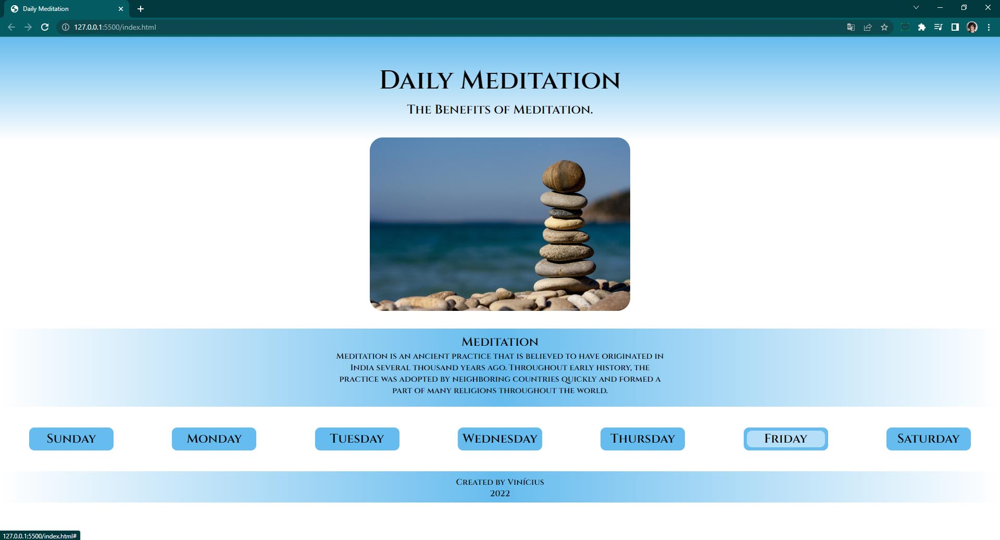
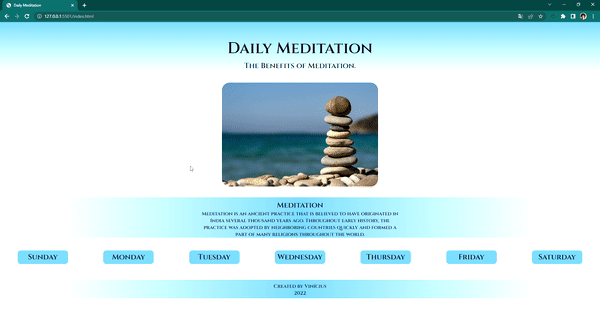

<h1 align="center">Projeto Website Meditation</h1>

Website desenvolvido para auxiliar pessoas que buscam os benefícios da meditação diária.

<h2>Tecnologias utilizadas:</h2>
<ul>
<li>HTML5</li>
<li>JavaScript</li>
<li>CSS3</li>
</ul>

<h2 align="center">Site em funcionamento</h2>

  

    
  

<a href="https://mendesvinicius7575.github.io/Projeto-Website-Meditation/index.html" target="_blank">Acessar o Site</a>

